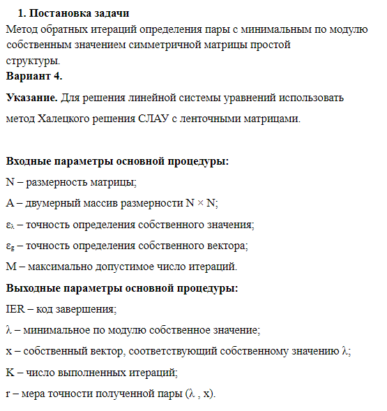

# Численные методы 5 семестр
**./lab1_17 Задание 1 Вариант 17**

Таск задание 1 Вариант 17

**./lab1_13 Задание 1 Вариант 13**

Таск задание 1 Вариант 13

**./lab2_3 Задание 2 Вариант 3**

Таск задание 2 Вариант 3

**./lab2_1 Задание 2 Вариант 1**

Таск задание 2 Вариант 1

**./lab3_3 Задание 3 Вариант 3**

Таск задание 3 Вариант 3

**./lab3_4 Задание 3 Вариант 4**

Таск задание 3 Вариант 4

